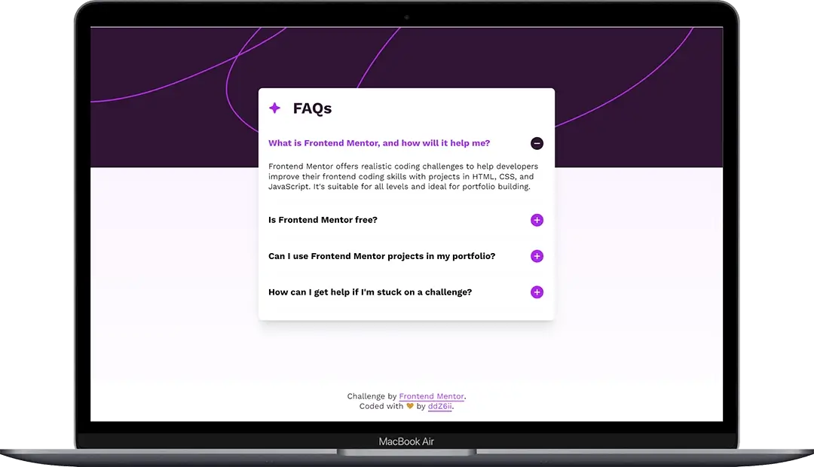

# Frontend Mentor - FAQ accordion solution

This is a solution to the [FAQ accordion challenge on Frontend Mentor](https://www.frontendmentor.io/challenges/faq-accordion-wyfFdeBwBz). Frontend Mentor challenges help you improve your coding skills by building realistic projects.

## Table of contents

- [Overview](#overview)
  - [The challenge](#the-challenge)
  - [Screenshots](#screenshots)
  - [Links](#links)
- [Getting started](#getting-started)
- [My process](#my-process)
  - [Built with](#built-with)
  - [Deployed with](#deployed-with)
  - [What I learned](#what-i-learned)
    - [Handling custom fonts](#handling-custom-fonts)
    - [Animating state transition](#animating-state-transition)
    - [Using motion feature query](#using-motion-feature-query)
  - [Useful resources](#useful-resources)
- [Author](#author)

## Overview

### The challenge

Users should be able to:

- Hide/Show the answer to a question when the question is clicked
- Navigate the questions and hide/show answers using keyboard navigation alone
- View the optimal layout for the interface depending on their device's screen size
- See hover and focus states for all interactive elements on the page

### Screenshots

- Mobile:

  

- Laptop/Desktop:

  

### Links

- Solution URL: [frontend-mentor-solution](https://www.frontendmentor.io/solutions/responsive-accessible-and-animated-faq-using-native-html-elements-yfeCwPBBHa)
- Live Site URL: [faq-accordion](https://faq-accordion-ten-theta.vercel.app/)

## Getting started

Clone the project and run the following command:

```console
yarn install
```

This will initialize the project by installing all the required dependencies.

## My process

### Built with


- Semantic HTML5 markup
- CSS Grid
- JavaScript for custom animation
- Vite bundler
- Mobile-first workflow

### Deployed with


### What I learned

#### Handling custom fonts

To efficiently manage and serve custom fonts, it is important to:

- prefer using _self-hosted_ fonts (third-party font services like Google Fonts are great but not privacy friendly neither GDPR compliant)
- limit the number of fonts used: the fastest font to deliver is a font that isn't requested in the first place
- prefer serving _variable font_ first. Contrary to static fonts which require a different file for each variation, variable fonts can comprise all their variations (weights, widths, and styles available) in a _single_ font file which can be serve with a single `@font-face` reference. This is particularly helpful in case of multiple font variations are used since it can lower the downloaded file size

```css
/* Use static fonts by default... */
font-family: 'WorkSans', sans-serif;

/*...but prefer loading variable font if supported (feature query). */
@supports (font-variation-settings: normal) {
  font-family: 'WorkSans VF', sans-serif;
}
```

- prefer using _modern font formats_ like `woff2` which has the widest browser support and offers the best compression, leading to less data to download and therefore faster performance
- provide different font formats as _fallbacks_ like `woff` or `ttf` to support old browsers and ensure excellent coverage

```css
@font-face {
  font-family: 'WorkSans VF';
  src:
    local('WorkSans'),
    /* Main modern font format. */
      url('/assets/fonts/WorkSans-VariableFont_wght.woff2') format('woff2-variations'),
    /* Fallback font format. */
      url('/assets/fonts/WorkSans-VariableFont_wght.woff') format('woff-variations'),
    url('/assets/fonts/WorkSans-VariableFont_wght.ttf') format('truetype-variations');
}
```

- implement an appropriate `font-display` strategy to decide how a browser should handle a not yet loaded font

#### Animating state transition

The main challenge was to animate the accordion's state transition (expanded / collapsed).

The reason is that interacting with the accordion automatically toggles an `open` attribute which cannot be animated (same problem as trying to animate to/from a `display: none` property).

One solution consists in _delaying the default behavior_ to first apply the desired animation or transition.

In this implementation, I use JavaScript to add a custom `expanded` attribute on the accordion's panel styled with CSS transition. This serves as an _intermediate transient_ state.

```css
&__panel {
  display: grid;
  /* Hide the the collapsed panel but leave it accessible to screen reader (contrary to display: none, the visibility property can be animated). */
  grid-template-rows: 0fr;
  visibility: hidden;
  /* Optional but better visual effect. */
  opacity: 0;

  /* Use a custom attribute (dynamically added/removed with JavaScript) to enable CSS transitions between the accordion states. */
  &[expanded='true'] {
    grid-template-rows: 1fr;
    visibility: visible;
    opacity: 1;
  }
}

&__drawer {
  overflow: hidden;
}
```

When transitioning from the collapsed to the expanded state, I simply used a `setTimeout()` function to asynchronously add the `expanded` attribute. This ensures the `open` attribute is set first prior running the animation. This seems to be enough to do the trick.

```javascript
if (!accordion.open) {
  /* Firefox fix. */
  setTimeout(() => {
    panel.setAttribute('expanded', 'true');
  }, 0);
}
```

Transitioning from the expanded to the collapsed state requires a bit more fiddling. The default behavior is to remove the `open` attribute from the `<details>` HTML element, which removes the accordion's panel from the DOM thus skipping any animation. The hack consists in:

1. preventing this default behavior using: `e.preventDefault()`
2. removing the custom `expanded` attribute which runs the CSS animation
3. waiting for the animation to end prior to resuming to the default behavior: `addEventListener('transitionend, () => { ... }, { once: true })`

```javascript
if (accordion.open) {
  /* 1 */
  e.preventDefault();
  /* 2 */
  panel.removeAttribute('expanded');
  /* 3 */
  panel.addEventListener(
    'transitionend',
    () => accordion.removeAttribute('open'),
    { once: true },
  );
}
```

#### Using motion feature query

⚠️ _People don’t always like motion or worse are sensitive to motion sickness!_

Therefore it is good practice to group _impactful_ animations/transition under a _feature query_

```css
@media (prefers-reduced-motion: no-preference) {
  /* ... */
}
```

💡 _This browser feature can be emulate in Chrome dev tools from the command palette (`CMD + SHIFT + P`), then typing \_reduced-motion_ and choosing _emulate_

</aside>

### Useful resources

- [Best practice for fonts](https://web.dev/articles/font-best-practices) - Excellent insightful article about optimiwinf font by _Katie Hempenius_ and _Barry Pollard_
- [Implementing a variable font with fallback web fonts](https://pimpmytype.com/variable-font-fallback/) - Great tutorial by _Oliver Schöndorfer_
- [Accoprdion pattern](https://www.w3.org/WAI/ARIA/apg/patterns/accordion/) - Useful doc for accordion by _Oliver Schöndorfer_
- [Details and summary](https://web.dev/learn/html/details) - Helpful article on disclosure widget with great examples
- [Animate from display none](https://www.youtube.com/watch?v=4prVdA7_6u0&list=PLB4ymnBGpxDd2D4U9t1UZZckddqxc6dzF&index=42&t=900s) - Great hack from the mighty CSS master _Kevin Powell_ 👍

## Author

- Github - [ddZ6ii](https://github.com/ddZ6ii)
- Frontend Mentor - [ddZ6ii](https://www.frontendmentor.io/profile/ddZ6ii)
- Linkedin - [denis-dezest](https://www.linkedin.com/in/denis-dezest/)
